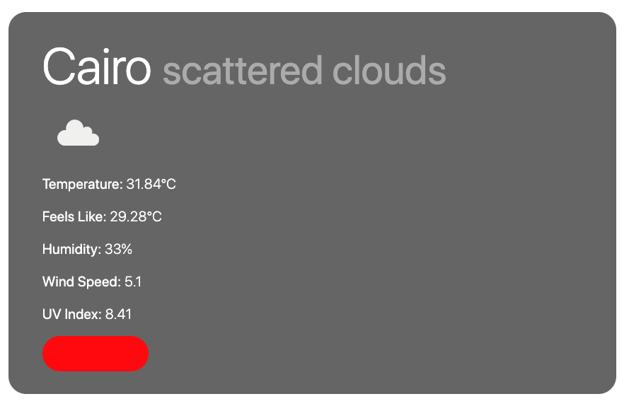

# Weather App

This simple weather application is designed to give the user the ability to search for the weather in any city in the world and get current temperature, "feels like temperature" humidity, wind speeds and UV index as well as an easy to read 5 day forecast. All information requested from [openweathermap](https://openweathermap.org/)

The added addition of the weather icons from the [openweathermap](https://openweathermap.org/) makes for an easier and quicker to read application. 
Using the [UV Index](https://openweathermap.org/api/uvi) API a small coloured div was added underneath the current weather data that is respondant to the UV index rating according to the colour coding on [Ultraviolet Index Wikipedia](https://en.wikipedia.org/wiki/Ultraviolet_index)

The 5 day forecast section has been put together using the [5 day weather forecast](https://openweathermap.org/forecast5) API and set so that each days forecast is defined at 3pm local time. (This hasn't been displayed but an earlier prototyped version had the option to do so) 
Each day/date is set using [moment js](https://momentjs.com/) and then formatted accordingly

On the left hand side of the page is a nav bar of sorts (albeit very rudimentary) that houses the search button used for finding the weather across the world. This side bar also houses the previously searched cities and places them in an appending list format to quickly grab and bring the information for that call back to the main section.

Overall I found this project much easier than some previous. 
Although I had some trouble towards the end involving the sidebar buttons doubling the information in the main section. I think this is from there being 2 on('click') functions that are in some way connected. Given more time I am sure I could figure it out and clean that code up.
I also had some minor issues with responsiveness I think only from having so many items created with jQuery. Once again if time allowed I could have worked through these issues which would have kept the code cleaner.

My only other observation is looking back at the code on completion I could have laid it all out nicer, using functions better to clean up the code.

### Not Sure What This Is
I also recieved a stange console error I haven't yet looked into but thought I would share it all the same.

